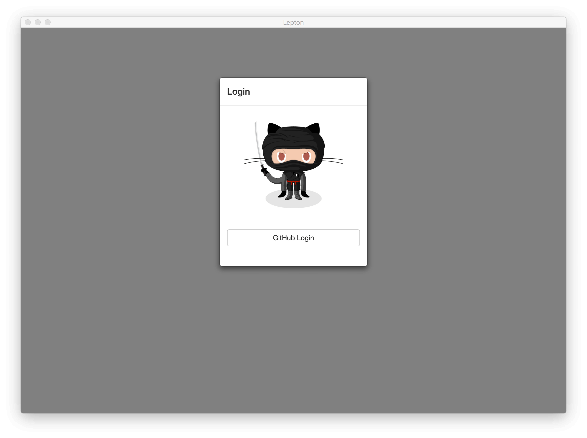

# Lepton

[](https://travis-ci.org/hackjutsu/Lepton)
[](http://standardjs.com/)
[](https://david-dm.org/hackjutsu/Lepton)
[](https://opensource.org/licenses/MIT)


**Lepton** is a lean [GitHub Gist](https://gist.github.com/) Desktop Client based on Electron. [Checkout the latest release.](https://github.com/hackjutsu/Lepton/releases)
- Group your gists by languages
- Create/Edit/Delete gists
- Instant search
- Custom tags
- Markdown rendering
- Cross-platform support
- Proxy


|      Organize         |  Markdown Rendering  | Immersive Mode *(⌘/Ctrl + i)* |
| :-------------:| :-----:| :-----: |
|  |  | 

|      Search (*⇧ + Space*)         |   Custom Tags    | GitHub Login |
| :-------------:| :-----:| :-----: |
|  |  | 

## Based on


1. Framework: [Electron](http://electron.atom.io/)
2. Bundler: [Webpack](http://webpack.github.io/docs/), [Babel](https://babeljs.io), [electron-builder](https://github.com/electron-userland/electron-builder)
3. Language: [ES2015](https://babeljs.io/docs/learn-es2015/), [Sass](http://sass-lang.com/)
4. Library: [React](https://facebook.github.io/react/), [Redux](https://github.com/reactjs/redux), [Redux Thunk](https://github.com/gaearon/redux-thunk), [Redux Form](http://redux-form.com/)
5. Lint: [ESLint](http://eslint.org/)

## Installation
- Download released binaries(macOS/Windows/Linux) from here:
[https://github.com/hackjutsu/Lepton/releases](https://github.com/hackjutsu/Lepton/releases)
- Install via Homebrew (macOS)
```bash
brew cask install lepton
```

## Development


### Install
>Tested with Node.js 6/7/8 

Clone the repository.
```Bash
$ git clone git@github.com:hackjutsu/Lepton.git
```
Install the dependencies.
```bash
$ cd Lepton && npm i
```

### Client ID/Secret
[Register your application](https://github.com/settings/applications/new), and put your client id and client secret in `./configs/account.js`.
```js
module.exports = {
  client_id: <your_client_id>,
  client_secret: <your_client_secret>
}
```

### Run
```bash
$ npm run build
$ npm run start
```

## Build Installer App
>Read [electron-builder docs](https://github.com/electron-userland/electron-builder#readme) and checkout [Code Signing](https://github.com/electron-userland/electron-builder#code-signing) before building the installer app.

Build app for macOS.
```bash
$ npm run dist -- -m
```
Build app for Windows.
```bash
$ npm run dist -- -w
```
Build app for Linux.
```bash
$ npm run dist -- -l
```
Build app for macOS, Windows and Linux.
```bash
$ npm run dist -- -wml
```
Build app for the current OS with the current arch.
```bash
$ npm run dist
```

## FAQ
#### My gist's language is classified as "Other"
Lepton depends on GitHub API to detect the language. If this fails, you can still put `// vim: syntax=<your_language>` at the top of the gist to specify the language.
```
// vim: syntax=javascript
let test = 'This is a javascript file'
```

#### I can't search the gist content
Limited by GitHub API, Lepton only supports the search for the following fields.
- file name
- description
- tag

#### Title and Tags
```
[title] description #tag1 #tag2
```

#### Proxy (Optional)
Copy and paste the following snippet to `~/.leptonrc`. Create the file if it does not exist, and don't forgot to change the address to your own one.
```
{
  "proxy": {
    "enable": true,
    "address": "socks://localhost:1080"
  }
}
```

#### Feedback
- Submit an [issue](https://github.com/hackjutsu/Lepton/issues).
- Send a [pull request](https://github.com/hackjutsu/Lepton/pulls).

#### Donation
*We DON'T accept donation personally.* If you like, feel free to donate to [Wikimedia Foundation](https://wikimediafoundation.org/wiki/Ways_to_Give), which helps sustain free knowledge through Wikipedia and its sister projects for people around the world. You are welcome to create an issue to share how much you have contributed.

## Contributors
<table id="contributors">
   <tr>
      <td><a href="https://github.com/hackjutsu">hackjutsu</a></td>
      <td><a href="https://github.com/wujysh">wujysh</a></td>
      <td><a href="https://github.com/DNLHC">DNLHC</a></td>
      <td><a href="https://github.com/meilinz">meilinz</a></td>
      <td><a href="https://github.com/lcgforever">lcgforever</a></td>
      <td><a href="https://github.com/Calinou">Calinou</a></td>
   </tr>
   <tr>
      <td><a href="https://github.com/rogersachan">rogersachan</a></td>
      <td><a href="https://github.com/passerbyid">passerbyid</a></td>
      <td><a href="https://github.com/YYSU">YYSU</a></td>
      <td><a href="https://github.com/cixuuz">cixuuz</a></td>
   </tr>
</table>

## License
MIT © [hackjutsu](https://github.com/hackjutsu)
