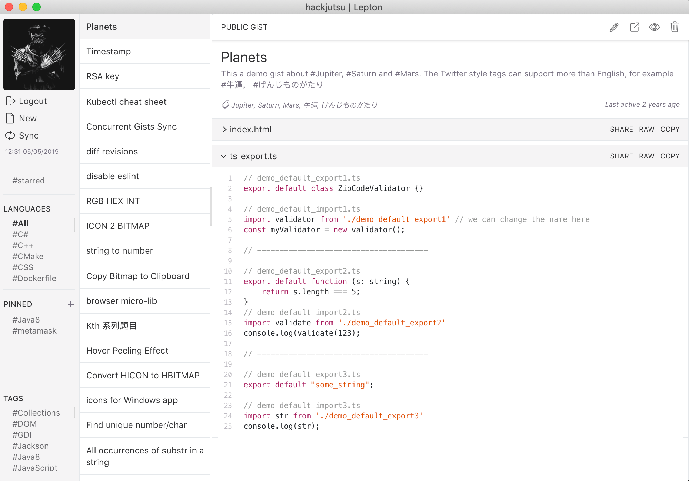
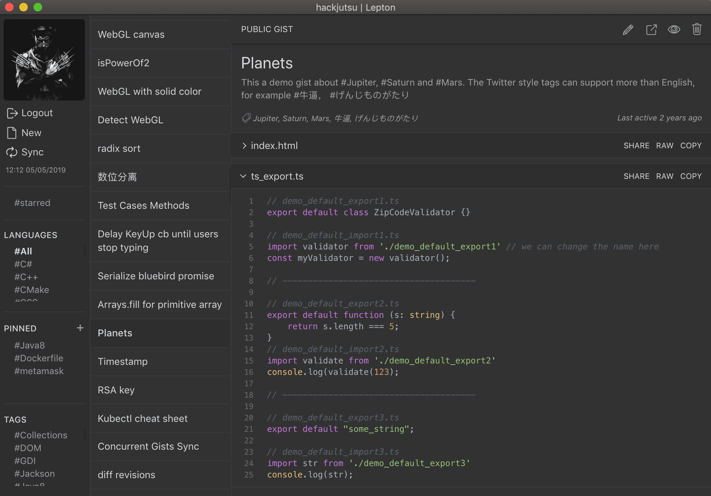
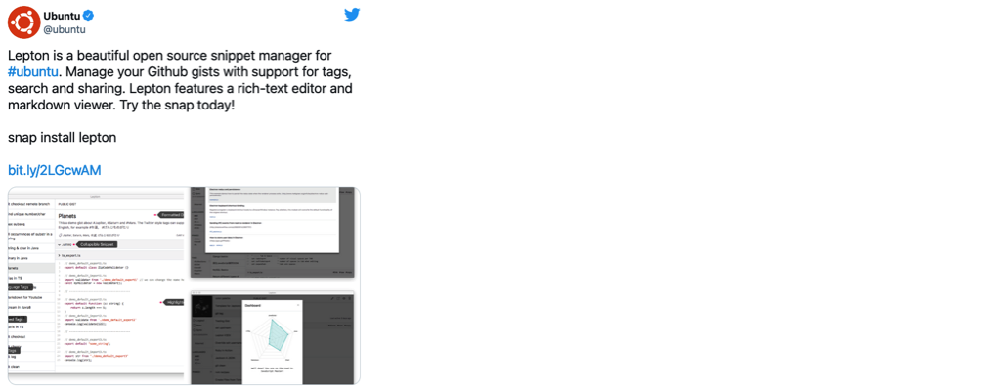

<!-- ALL-CONTRIBUTORS-BADGE:START - Do not remove or modify this section -->
[](#contributors-)
<!-- ALL-CONTRIBUTORS-BADGE:END -->


[](https://travis-ci.com/hackjutsu/Lepton)
[](https://david-dm.org/hackjutsu/Lepton)
[](https://opensource.org/licenses/MIT)
[](https://snapcraft.io/lepton)

**Lepton** is a lean code snippet manager powered by GitHub Gist. [Check out the latest release.](https://github.com/hackjutsu/Lepton/releases)

## Features
- Unlimited public/secret snippets
- Unlimited tags
- Language groups
- Markdown/JupyterNotebook
- [GitHub Enterprise](https://github.com/hackjutsu/Lepton/wiki/FAQ#enable-github-enterprise)
- GitHub token
- Immersive mode
- [Customizable](https://github.com/hackjutsu/Lepton/wiki/Configuration)
- Light/Dark theme
- macOS/Win/Linux
- Dashboard
- [Search](https://github.com/hackjutsu/Lepton/wiki/FAQ#search)
- [Proxy](https://github.com/hackjutsu/Lepton/wiki/FAQ#proxy)
- Free


| [Light Theme](https://github.com/hackjutsu/Lepton#customization)     | [Dark Theme](https://github.com/hackjutsu/Lepton#customization)    |
| :-------------:| :-----:|
|||

|      Organize         |  Markdown | Jupyter Notebook |
| :-------------:| :-----:| :-----: |
|  |  |  |

|      Search (*⇧ + Space*)         |    Immersive Mode *(⌘/Ctrl + i)*    | Dashboard *(⌘/Ctrl + d)* |
| :-------------:| :-----:| :-----: |
|  |  | 


## Shortcuts
| Function       | Shortcut       |  Note     |
| :------------: |:-------------: |:-----:|
| New Snippet    | `Cmd/Ctrl + N` | Create a snippet      |
| Edit Snippet   | `Cmd/Ctrl + E` | Edit a snippet      |
| Delete Snippet   | `Cmd/Ctrl + Del` | Delete selected snippet      |
| Submit         | `Cmd/Ctrl + S` | Submit the changes from the editor      |
| Cancel         | `Cmd/Ctrl + ESC` | Exit the editor without saving   |
| Sync           | `Cmd/Ctrl + R` | Sync with remote Gist server   |
| Immersive Mode | `Cmd/Ctrl + I` |  Toggle the [Immersive mode](https://github.com/hackjutsu/Lepton/blob/master/docs/img/portfolio/immersive.png)    |
| Dashboard      | `Cmd/Ctrl + D` |  Toggle the [dashboard](https://github.com/hackjutsu/Lepton/blob/master/docs/img/portfolio/dashboard.png)     |
| About Page     | `Cmd/Ctrl + ,` |  Toggle the [About page](https://github.com/hackjutsu/Lepton/blob/dev/docs/img/portfolio/about.png)    |
| Search         | `Shift + Space`|  Toggle the [search bar](https://github.com/hackjutsu/Lepton/blob/master/docs/img/portfolio/search_bar.png)    |

## Customization
Lepton's can be customized by `<home_dir>/.leptonrc`! You can find its exact path in the About page by `Command/Ctrl + ,`. Create the file if it does not exist.

- Theme (light/dark)
- Snippet
- Editor
- Logger
- Proxy
- Shortcuts
- Enterprise
- Notifications

Check out the [configuration docs](https://github.com/hackjutsu/Lepton/wiki/Configuration) to explore different customization options.

## Tech Stack


1. Framework: [Electron](http://electron.atom.io/)
2. Bundler: [Webpack](http://webpack.github.io/docs/), [Babel](https://babeljs.io), [electron-builder](https://github.com/electron-userland/electron-builder)
3. Language: [ES6](https://babeljs.io/docs/learn-es2015/), [Sass](http://sass-lang.com/)
4. Library: [React](https://facebook.github.io/react/), [Redux](https://github.com/reactjs/redux), [Redux Thunk](https://github.com/gaearon/redux-thunk), [Redux Form](http://redux-form.com/)
5. Lint: [ESLint](http://eslint.org/)

## Installation
- macOS/Windows/Linux: Download [the released packages](https://github.com/hackjutsu/Lepton/releases)
- macOS: Install via Homebrew
```bash
brew install --cask lepton
```
- Linux: Install via [Snap Store](https://snapcraft.io/lepton)
```bash
snap install lepton
```


## Development


### Install dependencies

```bash
$ git clone https://github.com/hackjutsu/Lepton.git
$ cd Lepton && yarn install
```

```bash
# inspect stale dependencies
$ yarn check-outdated
```

### Client ID/Secret
[Register your application](https://github.com/settings/applications/new), and put your client id and client secret in `./configs/account.js`.
```js
module.exports = {
  client_id: <your_client_id>,
  client_secret: <your_client_secret>
}
```

### Run
```bash
$ yarn build && yarn start
```

## Build Installer App
>Read [electron-builder docs](https://github.com/electron-userland/electron-builder#readme) and check out the [code signing wiki](https://github.com/electron-userland/electron-builder#code-signing) before building the installer app.

Build apps for macOS.
```bash
$ yarn dist -m
```
Build apps for Windows.
```bash
$ yarn dist -w
```
Build apps for Linux.

>Need a running [Docker](https://www.docker.com/) daemon to build a `snap` package.
```bash
$ yarn dist -l
```
Build apps for macOS, Windows and Linux.
```bash
$ yarn dist -wml
```
Build apps for the current OS with the current arch.
```bash
$ yarn dist
```

## FAQ
[--> Wiki FAQ](https://github.com/hackjutsu/Lepton/wiki/FAQ)

## Contributors
<!-- ALL-CONTRIBUTORS-LIST:START - Do not remove or modify this section -->
<!-- prettier-ignore-start -->
<!-- markdownlint-disable -->
<table>
  <tbody>
    <tr>
      <td align="center" valign="top" width="14.28%"><a href="https://airbnb.io/"><br /><sub><b>CosmoX</b></sub></a><br /><a href="https://github.com/hackjutsu/Lepton/commits?author=hackjutsu" title="Code">💻</a> <a href="#design-hackjutsu" title="Design">🎨</a> <a href="https://github.com/hackjutsu/Lepton/commits?author=hackjutsu" title="Tests">⚠️</a> <a href="#maintenance-hackjutsu" title="Maintenance">🚧</a> <a href="#platform-hackjutsu" title="Packaging/porting to new platform">📦</a> <a href="#ideas-hackjutsu" title="Ideas, Planning, & Feedback">🤔</a></td>
      <td align="center" valign="top" width="14.28%"><a href="https://loveac.cn"><br /><sub><b>Jiaye Wu</b></sub></a><br /><a href="https://github.com/hackjutsu/Lepton/commits?author=wujysh" title="Code">💻</a> <a href="#maintenance-wujysh" title="Maintenance">🚧</a> <a href="#ideas-wujysh" title="Ideas, Planning, & Feedback">🤔</a></td>
      <td align="center" valign="top" width="14.28%"><a href="https://github.com/DNLHC"><br /><sub><b>Danila</b></sub></a><br /><a href="https://github.com/hackjutsu/Lepton/commits?author=DNLHC" title="Code">💻</a> <a href="#design-DNLHC" title="Design">🎨</a> <a href="#maintenance-DNLHC" title="Maintenance">🚧</a></td>
      <td align="center" valign="top" width="14.28%"><a href="http://www.meilinzhan.com/"><br /><sub><b>Meilin Zhan</b></sub></a><br /><a href="https://github.com/hackjutsu/Lepton/commits?author=meilinz" title="Code">💻</a> <a href="#ideas-meilinz" title="Ideas, Planning, & Feedback">🤔</a> <a href="#maintenance-meilinz" title="Maintenance">🚧</a></td>
      <td align="center" valign="top" width="14.28%"><a href="http://www.linkedin.com/in/liuchenguang"><br /><sub><b>lcgforever</b></sub></a><br /><a href="https://github.com/hackjutsu/Lepton/commits?author=lcgforever" title="Code">💻</a></td>
      <td align="center" valign="top" width="14.28%"><a href="https://github.com/passerbyid"><br /><sub><b>Yuer Lee</b></sub></a><br /><a href="https://github.com/hackjutsu/Lepton/commits?author=passerbyid" title="Documentation">📖</a> <a href="#platform-passerbyid" title="Packaging/porting to new platform">📦</a></td>
      <td align="center" valign="top" width="14.28%"><a href="http://yysu.github.io/About-me"><br /><sub><b>Su,Yen-Yun</b></sub></a><br /><a href="https://github.com/hackjutsu/Lepton/commits?author=YYSU" title="Documentation">📖</a></td>
    </tr>
    <tr>
      <td align="center" valign="top" width="14.28%"><a href="https://cixuuz.github.io/"><br /><sub><b>Chen Tong</b></sub></a><br /><a href="https://github.com/hackjutsu/Lepton/commits?author=cixuuz" title="Code">💻</a> <a href="#ideas-cixuuz" title="Ideas, Planning, & Feedback">🤔</a> <a href="#maintenance-cixuuz" title="Maintenance">🚧</a></td>
      <td align="center" valign="top" width="14.28%"><a href="https://github.com/Gisonrg"><br /><sub><b>Jason Jiang</b></sub></a><br /><a href="https://github.com/hackjutsu/Lepton/commits?author=Gisonrg" title="Code">💻</a></td>
      <td align="center" valign="top" width="14.28%"><a href="http://popey.com/"><br /><sub><b>Alan Pope</b></sub></a><br /><a href="#platform-popey" title="Packaging/porting to new platform">📦</a></td>
      <td align="center" valign="top" width="14.28%"><a href="https://tonyxu.io"><br /><sub><b>Tony Xu</b></sub></a><br /><a href="#platform-tonyxu-io" title="Packaging/porting to new platform">📦</a></td>
      <td align="center" valign="top" width="14.28%"><a href="https://tegan.lol"><br /><sub><b>Tegan Churchill</b></sub></a><br /><a href="https://github.com/hackjutsu/Lepton/commits?author=rawrmonstar" title="Code">💻</a></td>
      <td align="center" valign="top" width="14.28%"><a href="https://github.com/AngieW0908"><br /><sub><b>Angie Wang</b></sub></a><br /><a href="#design-AngieW0908" title="Design">🎨</a></td>
      <td align="center" valign="top" width="14.28%"><a href="http://batuhanbayrakci.com"><br /><sub><b>Batuhan Bayrakci</b></sub></a><br /><a href="https://github.com/hackjutsu/Lepton/commits?author=baybatu" title="Code">💻</a></td>
    </tr>
    <tr>
      <td align="center" valign="top" width="14.28%"><a href="https://samuelmeuli.com"><br /><sub><b>Samuel Meuli</b></sub></a><br /><a href="https://github.com/hackjutsu/Lepton/commits?author=samuelmeuli" title="Code">💻</a></td>
      <td align="center" valign="top" width="14.28%"><a href="https://www.linkedin.com/in/alexandreamadocastro"><br /><sub><b>Alexandre Amado de Castro</b></sub></a><br /><a href="https://github.com/hackjutsu/Lepton/commits?author=alexandreamadocastro" title="Code">💻</a></td>
      <td align="center" valign="top" width="14.28%"><a href="http://abner.space/"><br /><sub><b>Abner Soares Alves Junior</b></sub></a><br /><a href="https://github.com/hackjutsu/Lepton/commits?author=abnersajr" title="Code">💻</a></td>
      <td align="center" valign="top" width="14.28%"><a href="http://seanz.me"><br /><sub><b>Sean</b></sub></a><br /><a href="https://github.com/hackjutsu/Lepton/commits?author=seancheung" title="Code">💻</a></td>
      <td align="center" valign="top" width="14.28%"><a href="https://github.com/moia-sven-ole"><br /><sub><b>Ole</b></sub></a><br /><a href="https://github.com/hackjutsu/Lepton/commits?author=moia-sven-ole" title="Code">💻</a></td>
      <td align="center" valign="top" width="14.28%"><a href="https://www.linkedin.com/in/GabrielNicolasAvellaneda/"><br /><sub><b>Gabriel Nicolas Avellaneda</b></sub></a><br /><a href="https://github.com/hackjutsu/Lepton/commits?author=GabrielNicolasAvellaneda" title="Code">💻</a> <a href="https://github.com/hackjutsu/Lepton/commits?author=GabrielNicolasAvellaneda" title="Documentation">📖</a></td>
      <td align="center" valign="top" width="14.28%"><a href="https://dideler.github.io"><br /><sub><b>Dennis Ideler</b></sub></a><br /><a href="https://github.com/hackjutsu/Lepton/commits?author=dideler" title="Code">💻</a> <a href="#ideas-dideler" title="Ideas, Planning, & Feedback">🤔</a> <a href="https://github.com/hackjutsu/Lepton/commits?author=dideler" title="Documentation">📖</a></td>
    </tr>
    <tr>
      <td align="center" valign="top" width="14.28%"><a href="http://AnthonyAttard.com"><br /><sub><b>Anthony Attard</b></sub></a><br /><a href="https://github.com/hackjutsu/Lepton/commits?author=anthonyattard" title="Code">💻</a></td>
      <td align="center" valign="top" width="14.28%"><a href="https://ArLEquiN64.github.io/"><br /><sub><b>ArLE</b></sub></a><br /><a href="https://github.com/hackjutsu/Lepton/commits?author=ArLEquiN64" title="Code">💻</a></td>
      <td align="center" valign="top" width="14.28%"><a href="http://www.polnetwork.com"><br /><sub><b>Pol Maresma</b></sub></a><br /><a href="https://github.com/hackjutsu/Lepton/commits?author=polnetwork" title="Code">💻</a></td>
      <td align="center" valign="top" width="14.28%"><a href="https://blog.jubeat.net"><br /><sub><b>PM Extra</b></sub></a><br /><a href="https://github.com/hackjutsu/Lepton/commits?author=PMExtra" title="Code">💻</a></td>
      <td align="center" valign="top" width="14.28%"><a href="https://zava.carrd.co/"><br /><sub><b>Zava</b></sub></a><br /><a href="https://github.com/hackjutsu/Lepton/commits?author=EdZava" title="Code">💻</a></td>
      <td align="center" valign="top" width="14.28%"><a href="http://www.linkedin.com/in/jasonralexander"><br /><sub><b>Jason R Alexander</b></sub></a><br /><a href="https://github.com/hackjutsu/Lepton/commits?author=sunnysidesounds" title="Code">💻</a></td>
      <td align="center" valign="top" width="14.28%"><a href="http://irrelevant.at"><br /><sub><b>Sebastian Hojas</b></sub></a><br /><a href="https://github.com/hackjutsu/Lepton/commits?author=Sebastian-Hojas" title="Documentation">📖</a></td>
    </tr>
    <tr>
      <td align="center" valign="top" width="14.28%"><a href="https://github.com/yuhang-dong"><br /><sub><b>董雨航</b></sub></a><br /><a href="https://github.com/hackjutsu/Lepton/commits?author=yuhang-dong" title="Code">💻</a></td>
      <td align="center" valign="top" width="14.28%"><a href="https://sxyz.blog"><br /><sub><b>sxyazi</b></sub></a><br /><a href="#platform-sxyazi" title="Packaging/porting to new platform">📦</a></td>
      <td align="center" valign="top" width="14.28%"><a href="https://megabyte.space"><br /><sub><b>Brian Zalewski</b></sub></a><br /><a href="#platform-ProfessorManhattan" title="Packaging/porting to new platform">📦</a></td>
    </tr>
  </tbody>
</table>

<!-- markdownlint-restore -->
<!-- prettier-ignore-end -->

<!-- ALL-CONTRIBUTORS-LIST:END -->

## License
MIT © [hackjutsu](https://github.com/hackjutsu)
