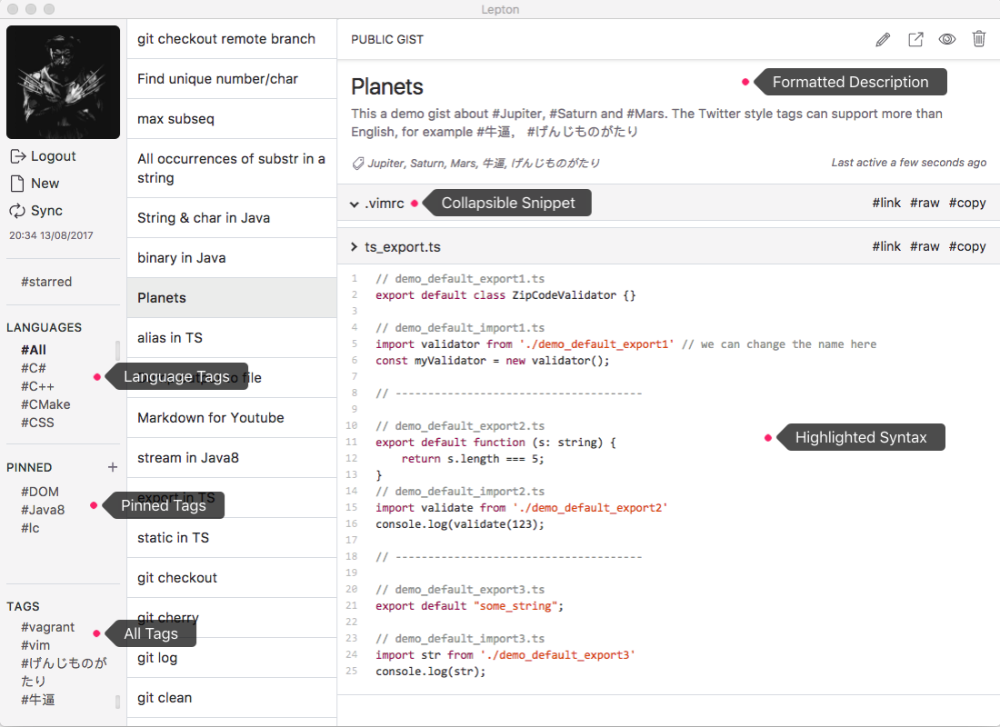
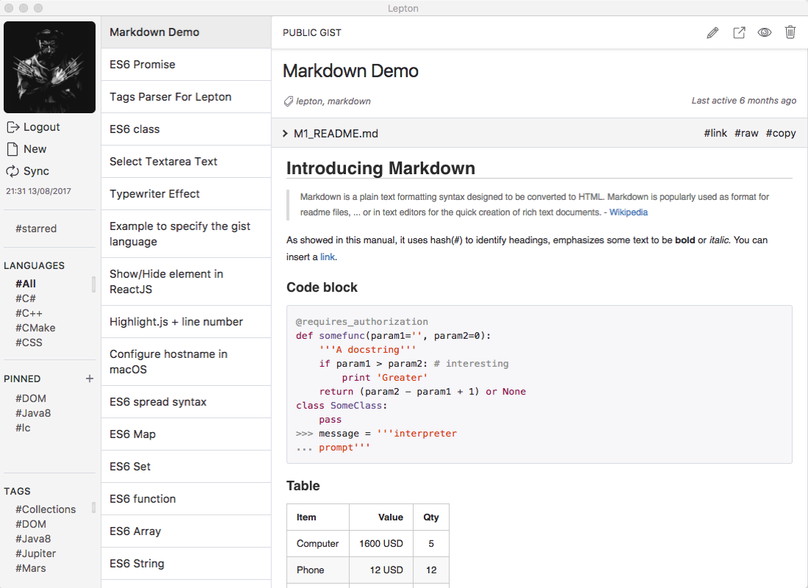
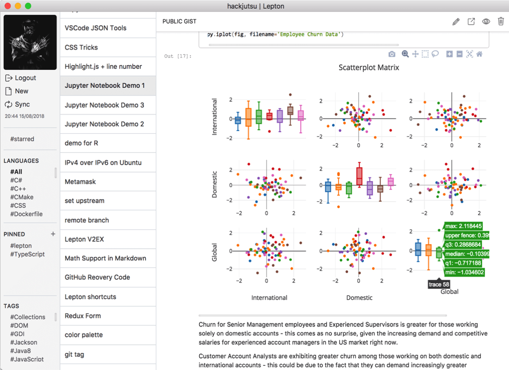
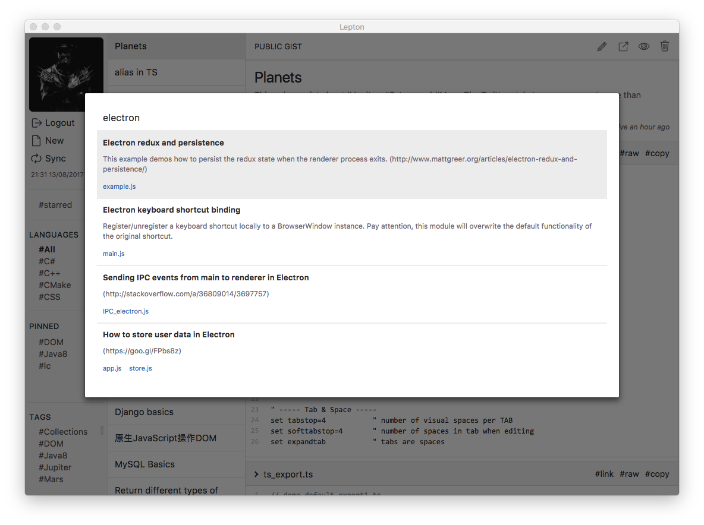
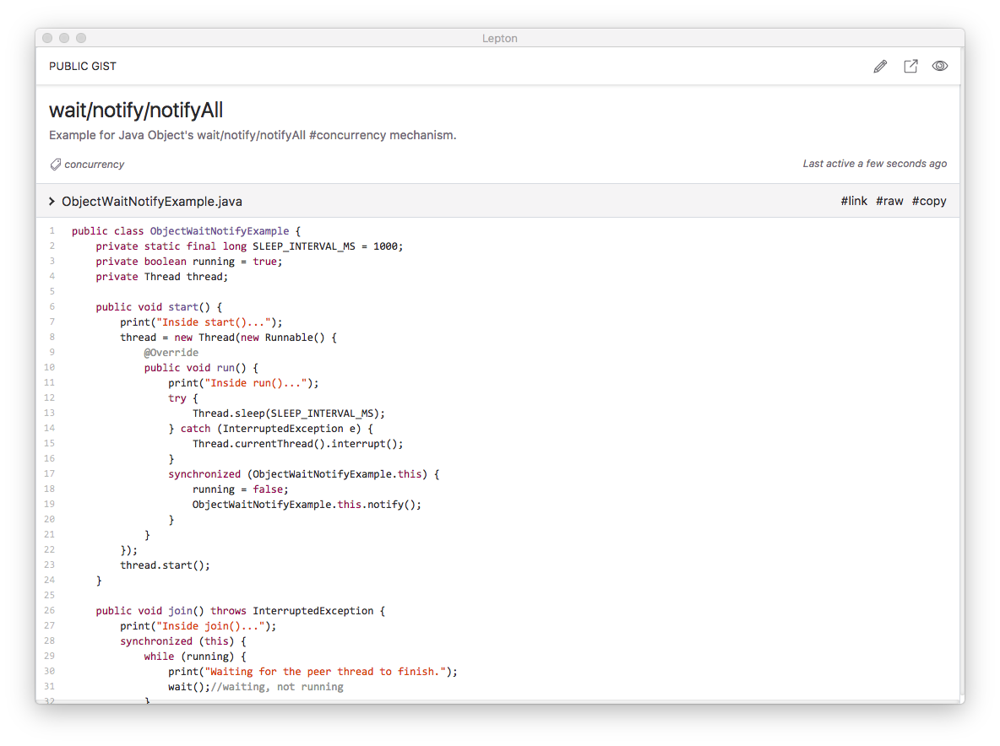
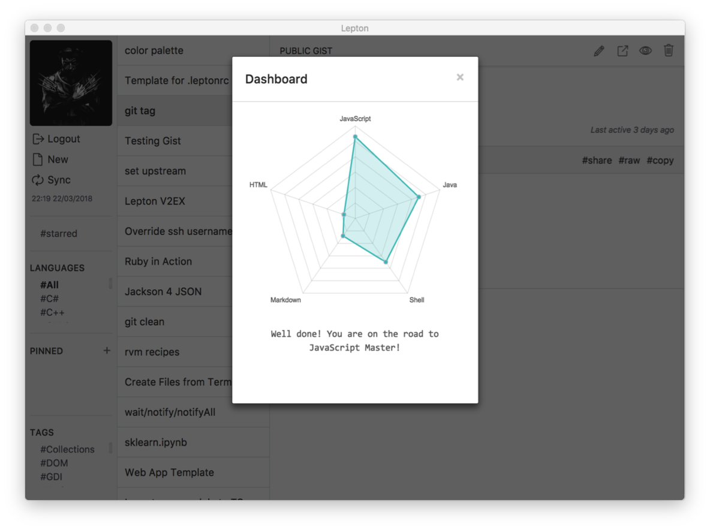

[](https://travis-ci.org/hackjutsu/Lepton)
[](http://standardjs.com/)
[](https://david-dm.org/hackjutsu/Lepton)
[](https://spectrum.chat/Lepton>)
[](https://opensource.org/licenses/MIT)


**Lepton** is a lean code snippet manager based on *GitHub Gist*. [Check out its latest release.](https://github.com/hackjutsu/Lepton/releases)

- Unlimited public/private snippets
- Unlimited tags
- Language groups
- Markdown support
- Jupyter Notebook viewer support
- macOS/Win/Linux support
- GitHub Enterprise support
- Immersive mode
- Customizable
- Dashboard
- Search
- Proxy
- Free



|      Organize         |  Markdown | Jupyter Notebook |
| :-------------:| :-----:| :-----: |
|  |  | 

|      Search (*⇧ + Space*)         |    Immersive Mode *(⌘/Ctrl + i)*    | Dashboard *(⌘/Ctrl + d)* |
| :-------------:| :-----:| :-----: |
|  |  | 


## Shortcuts
| Function       | Shortcut       |  Note     |
| :------------: |:-------------: |:-----:|
| New Snippet    | `Cmd/Ctrl + N` | Create a snippet      |
| Edit Snippet   | `Cmd/Ctrl + E` | Edit a snippet      |
| Submit         | `Cmd/Ctrl + S` | Submit the changes from the editor      |
| Cancel         | `Cmd/Ctrl + ESC` | Exit the editor without saving   |
| Sync           | `Cmd/Ctrl + R` | Sync with remote Gist server   |
| Immersive Mode | `Cmd/Ctrl + I` |  Toggle the [Immersive mode](https://github.com/hackjutsu/Lepton/blob/master/docs/img/portfolio/immersive.png)    |
| Dashboard      | `Cmd/Ctrl + D` |  Toggle the [dashboard](https://github.com/hackjutsu/Lepton/blob/master/docs/img/portfolio/dashboard.png)     |
| About Page     | `Cmd/Ctrl + ,` |  Toggle the [About page](https://github.com/hackjutsu/Lepton/blob/dev/docs/img/portfolio/about.png)    |
| Search         | `Shift + Space`|  Toggle the [search bar](https://github.com/hackjutsu/Lepton/blob/master/docs/img/portfolio/search_bar.png)    |

## Tech Stack


1. Framework: [Electron](http://electron.atom.io/)
2. Bundler: [Webpack](http://webpack.github.io/docs/), [Babel](https://babeljs.io), [electron-builder](https://github.com/electron-userland/electron-builder)
3. Language: [ES6](https://babeljs.io/docs/learn-es2015/), [Sass](http://sass-lang.com/)
4. Library: [React](https://facebook.github.io/react/), [Redux](https://github.com/reactjs/redux), [Redux Thunk](https://github.com/gaearon/redux-thunk), [Redux Form](http://redux-form.com/)
5. Lint: [ESLint](http://eslint.org/)

## Installation
- Download released binaries(macOS/Windows/Linux) [here](https://github.com/hackjutsu/Lepton/releases).
- Install via Homebrew (macOS)
```bash
brew cask install lepton
```

## Development


### Install dependencies

```bash
$ git clone git@github.com:hackjutsu/Lepton.git
$ cd Lepton && npm i
```

### Client ID/Secret
[Register your application](https://github.com/settings/applications/new), and put your client id and client secret in `./configs/account.js`.
```js
module.exports = {
  client_id: <your_client_id>,
  client_secret: <your_client_secret>
}
```

### Run
```bash
$ npm run build && npm run start
```

## Build Installer App
>Read [electron-builder docs](https://github.com/electron-userland/electron-builder#readme) and check out the [code signing wiki](https://github.com/electron-userland/electron-builder#code-signing) before building the installer app.

Build apps for macOS.
```bash
$ npm run dist -- -m
```
Build apps for Windows.
```bash
$ npm run dist -- -w
```
Build apps for Linux. 

>Need a running [Docker](https://www.docker.com/) daemon to build a `snap` package.
```bash
$ npm run dist -- -l
```
Build apps for macOS, Windows and Linux.
```bash
$ npm run dist -- -wml
```
Build apps for the current OS with the current arch.
```bash
$ npm run dist
```

## Configurations
Lepton can be configured by `<home_dir>/.leptonrc` in the these fields. (Create the file if it does not exist.)

- Snippet
- Editor
- Logger
- Proxy
- Enterprise

Check out the [.leptonrc template](https://gist.github.com/1ad7e4968eb64d881ec9dedd6c0f400b) to explore their options.

## FAQ
[--> Wiki FAQ](https://github.com/hackjutsu/Lepton/wiki/FAQ)

## Contributors
<table id="contributors">
   <tr>
      <td><a href="https://github.com/hackjutsu">hackjutsu</a></td>
      <td><a href="https://github.com/wujysh">wujysh</a></td>
      <td><a href="https://github.com/DNLHC">DNLHC</a></td>
      <td><a href="https://github.com/meilinz">meilinz</a></td>
      <td><a href="https://github.com/lcgforever">lcgforever</a></td>
      <td><a href="https://github.com/Calinou">Calinou</a></td>
   </tr>
   <tr>
      <td><a href="https://github.com/rogersachan">rogersachan</a></td>
      <td><a href="https://github.com/passerbyid">passerbyid</a></td>
      <td><a href="https://github.com/YYSU">YYSU</a></td>
      <td><a href="https://github.com/cixuuz">cixuuz</a></td>
      <td><a href="https://github.com/Gisonrg">Gisonrg</a></td>
      <td><a href="https://github.com/ArLEquiN64">ArLEquiN64</a></td>
   </tr>
   <tr>
      <td><a href="https://github.com/popey">popey</a></td>
      <td><a href="https://github.com/tonyxu-io">tonyxu-io</a></td>
      <td><a href="https://github.com/rawrmonstar">rawrmonstar</a></td>
      <td><a href="https://github.com/baybatu">baybatu</a></td>
   </tr>
</table>

## License
MIT © [hackjutsu](https://github.com/hackjutsu)
