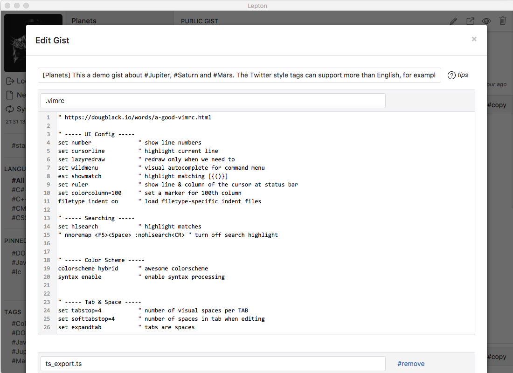

# Lepton


|      Organize         |   Search (*Shift + Space*) |
| :-------------:| :-----:|
|  |  |

|      Markdown Renderding         |   Custom Tags    |
| :-------------:| :-----:|
|  |  |


**Lepton** is a lean [GitHub Gist](https://gist.github.com/) Desktop Client based on Electron.
- Group your gists by languages
- Create/Edit/Delete gists
- Instant search
- Custom tags
- Markdown rendering
- Cross-platform support

[](https://travis-ci.org/hackjutsu/Lepton)
[](http://standardjs.com/)
[](https://david-dm.org/hackjutsu/Lepton)
[](https://opensource.org/licenses/MIT)

## Based on


1. Framework: [Electron](http://electron.atom.io/)
2. Bundler: [Webpack](http://webpack.github.io/docs/), [Babel](https://babeljs.io), [electron-builder](https://github.com/electron-userland/electron-builder)
3. Language: [ES2015](https://babeljs.io/docs/learn-es2015/), [Sass](http://sass-lang.com/)
4. Library: [React](https://facebook.github.io/react/), [Redux](https://github.com/reactjs/redux), [Redux Thunk](https://github.com/gaearon/redux-thunk), [Redux Form](http://redux-form.com/)
5. Lint: [ESLint](http://eslint.org/)

## Development


### Install
Clone the repository.
```Bash
$ git clone git@github.com:hackjutsu/Lepton.git
```
Install the dependencies.
```bash
$ cd Lepton && npm i
```

### Client ID/Secret
[Register your application](https://github.com/settings/applications/new), and put your client id and client secret in `./configs/account.js`.
```js
module.exports = {
  client_id: <your_client_id>,
  client_secret: <your_client_secret>
}
```

### Run
```bash
$ npm run test
$ npm run start
```

## Build Installer App
>Read [electron-builder docs](https://github.com/electron-userland/electron-builder#readme) and checkout [Code Signing](https://github.com/electron-userland/electron-builder#code-signing) before building the installer app.

Build app for macOS.
```bash
$ npm run dist -- -m
```
Build app for Windows.
```bash
$ npm run dist -- -w
```
Build app for Linux.
```bash
$ npm run dist -- -l
```
Build app for macOS, Windows and Linux.
```bash
$ npm run dist -- -wml
```
Build app for the current OS with the current arch.
```bash
$ npm run dist
```
## License
MIT © [hackjutsu](https://github.com/hackjutsu)
