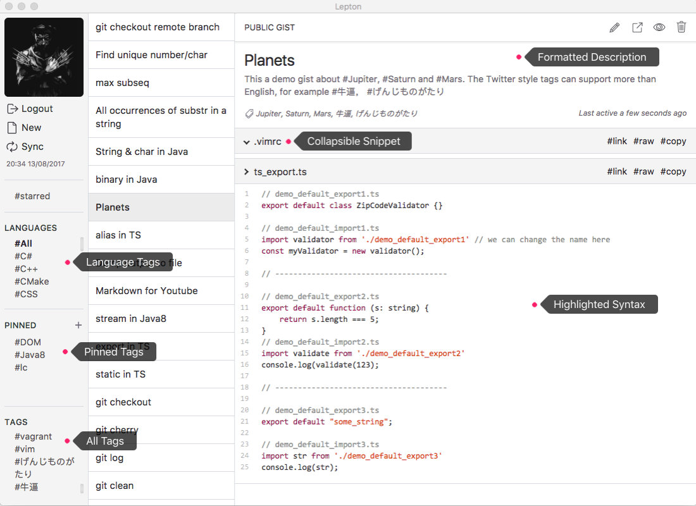
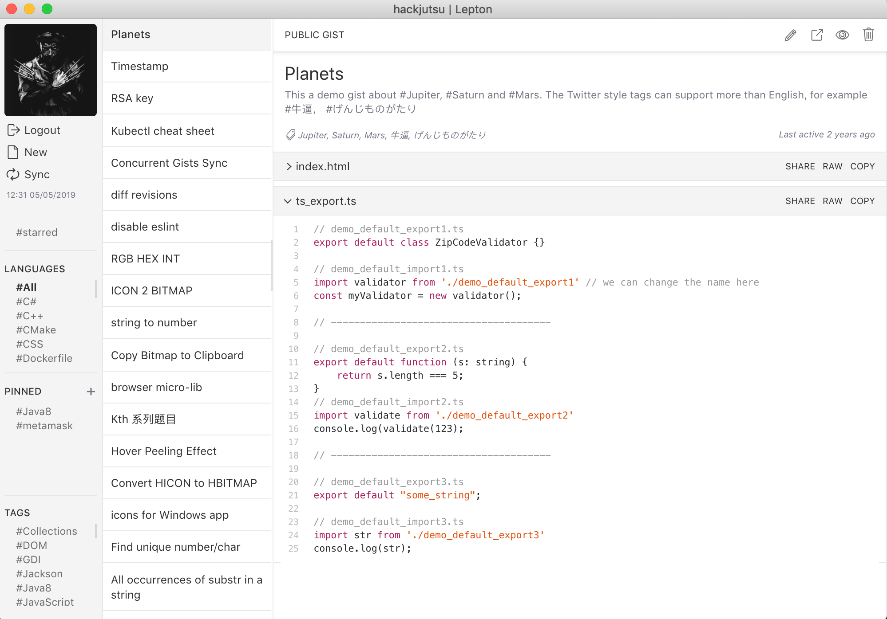
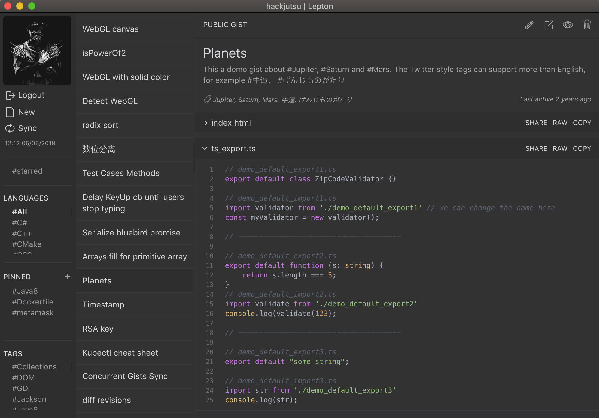
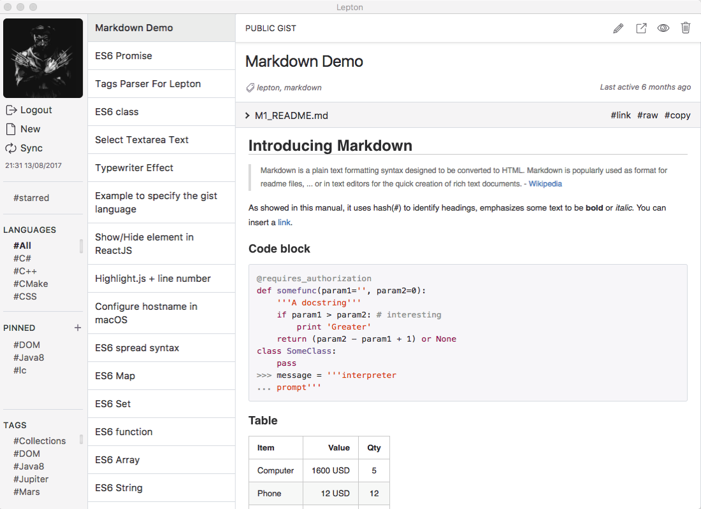
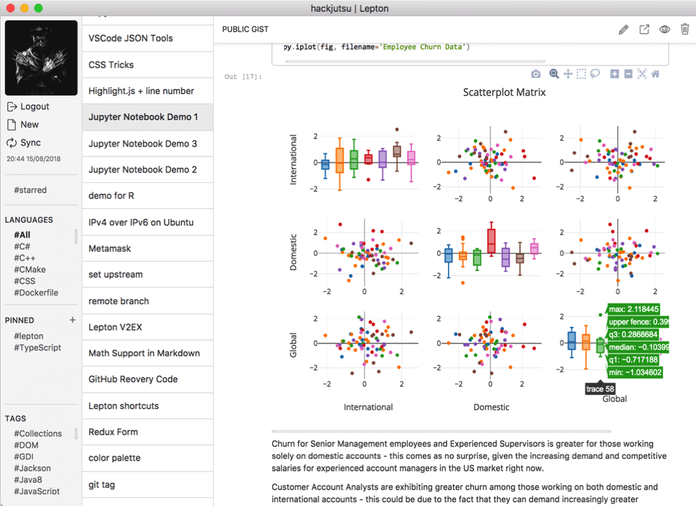
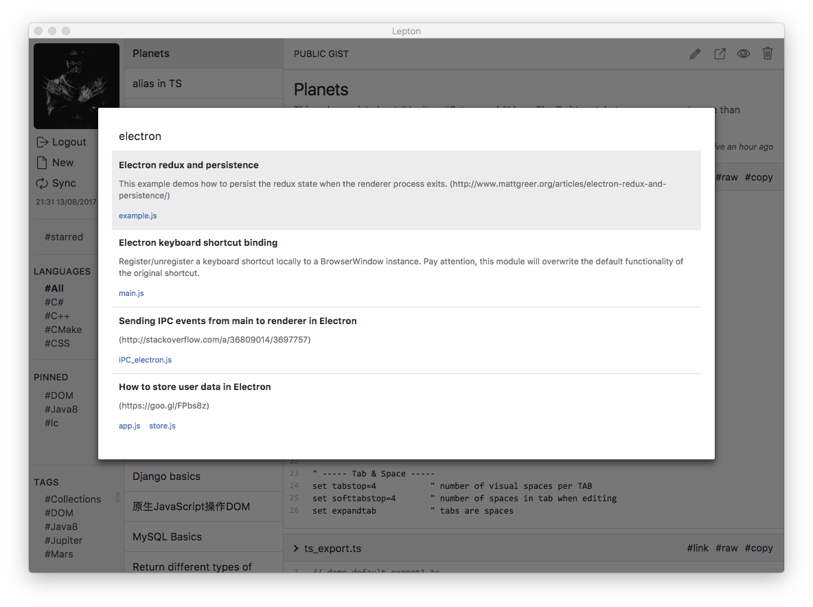
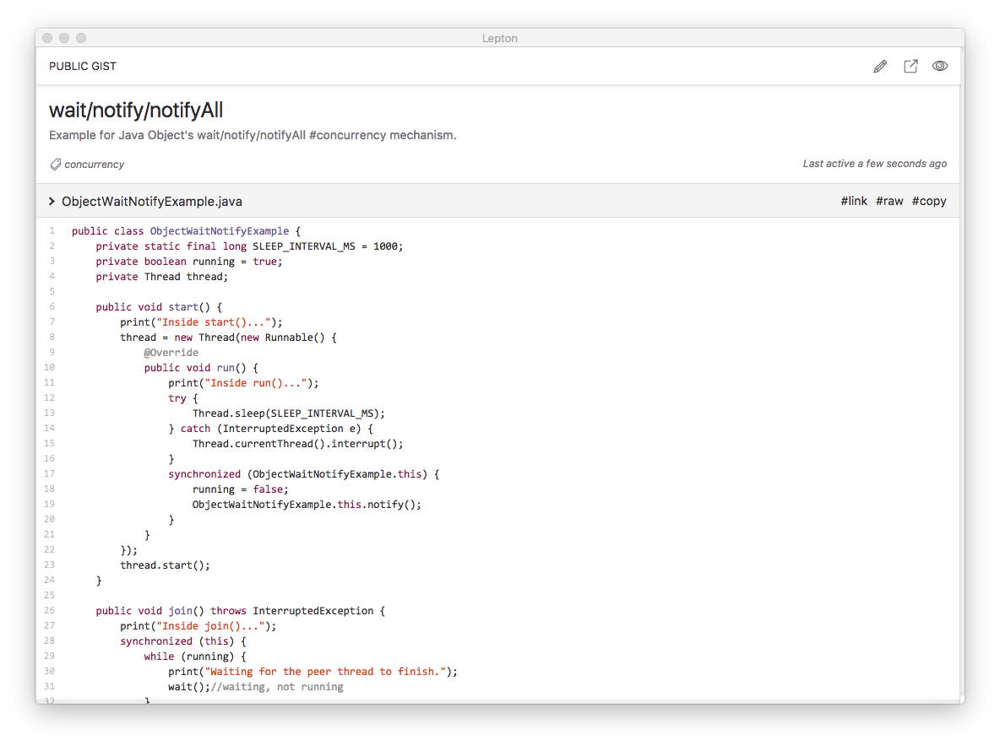
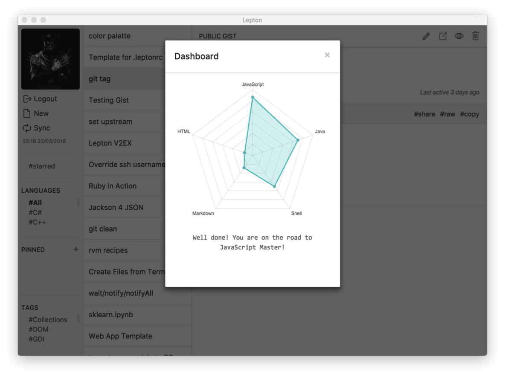
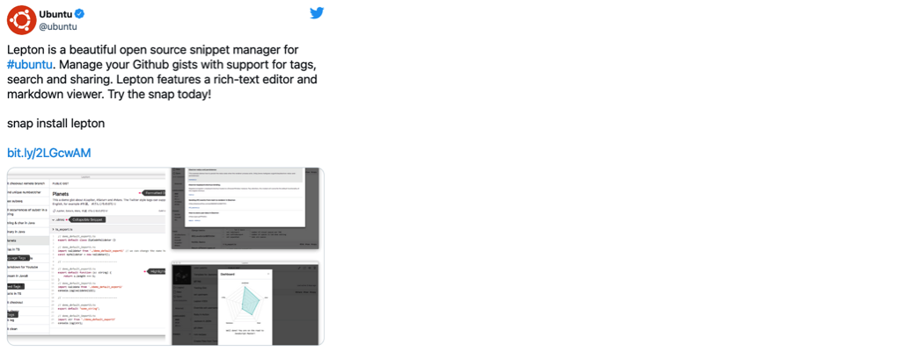

<!-- ALL-CONTRIBUTORS-BADGE:START - Do not remove or modify this section -->
[](#contributors-)
<!-- ALL-CONTRIBUTORS-BADGE:END -->


[](https://opensource.org/licenses/MIT)
[](https://snapcraft.io/lepton)

**Lepton** is a lean code snippet manager powered by GitHub Gist. [Check out the latest release.](https://github.com/hackjutsu/Lepton/releases)

## Features
- Unlimited public/secret snippets
- Unlimited tags
- Language groups
- Markdown/JupyterNotebook
- [GitHub Enterprise](wiki/faq.md#enable-github-enterprise)
- GitHub token
- Immersive mode
- [Customizable](wiki/configuration.md)
- Built-in themes
- macOS/Win/Linux
- Dashboard
- [Search snippets and downloaded content](wiki/faq.md#search)
- [Proxy](wiki/faq.md#proxy)
- Free



| [Light Theme](https://github.com/hackjutsu/Lepton#customization)     | [Dark Theme](https://github.com/hackjutsu/Lepton#customization)    |
| :-------------:| :-----:|
|||

|      Organize         |  Markdown | Jupyter Notebook |
| :-------------:| :-----:| :-----: |
|  |  |  |

|      Search snippets and content (*⇧ + Space*)         |    Immersive Mode *(⌘/Ctrl + i)*    | Dashboard *(⌘/Ctrl + d)* |
| :-------------:| :-----:| :-----: |
|  |  | 


## Shortcuts
| Function       | Shortcut       |  Note     |
| :------------: |:-------------: |:-----:|
| New Snippet    | `Cmd/Ctrl + N` | Create a snippet      |
| Edit Snippet   | `Cmd/Ctrl + E` | Edit a snippet      |
| Delete Snippet   | `Cmd/Ctrl + Del` | Delete selected snippet      |
| Submit         | `Cmd/Ctrl + S` | Submit the changes from the editor      |
| Sync           | `Cmd/Ctrl + R` | Sync with remote Gist server   |
| Immersive Mode | `Cmd/Ctrl + I` |  Toggle the [Immersive mode](https://github.com/hackjutsu/Lepton/blob/master/docs/img/portfolio/immersive.png)    |
| Dashboard      | `Cmd/Ctrl + D` |  Toggle the [dashboard](https://github.com/hackjutsu/Lepton/blob/master/docs/img/portfolio/dashboard.png)     |
| About Page     | `Cmd/Ctrl + ,` |  Toggle the [About page](https://github.com/hackjutsu/Lepton/blob/dev/docs/img/portfolio/about.png)    |
| Search         | `Shift + Space`|  Toggle [snippet and downloaded-content search](wiki/faq.md#search)    |

See the [Search FAQ](wiki/faq.md#search) for searchable fields and content-search behavior.

## Customization
Lepton's can be customized by `<home_dir>/.leptonrc`! You can find its exact path in the About page by `Command/Ctrl + ,`. Create the file if it does not exist.

- Theme (`light`, `dark`, `one-dark`, `atom-one-dark`, `github-light`, `github-dark`, `catppuccin-latte`, `catppuccin-mocha`, `solarized-light`, `solarized-dark`, `dracula`, `material-theme`, or `ayu`)
- Snippet
- Gist
- Editor
- Logger
- Proxy
- Shortcuts
- Zoom
- Enterprise
- Notifications
- Interface language (`i18n.locale`: `en`, `es`, `fr`, `ja`, `ko`, `tr`, `zh-Hans`, or `zh-Hant`)

Check out the [configuration docs](wiki/configuration.md) to explore different customization options.
Missing a locale? See [How do I add a new interface locale?](wiki/faq.md#how-do-i-add-a-new-interface-locale)

## Tech Stack


1. Framework: [Electron](http://electron.atom.io/)
2. Bundler: [Webpack](http://webpack.github.io/docs/), [Babel](https://babeljs.io), [electron-builder](https://github.com/electron-userland/electron-builder)
3. Language: ES6, Sass/SCSS
4. UI/state: React 19, Redux, React Redux, Redux Thunk
5. Editor/rendering: CodeMirror, Highlight.js, Markdown/Jupyter rendering
6. Tests/lint: Vitest, Electron smoke tests, ESLint

Now you can learn about Lepton project's code structure in [DeepWiki](https://deepwiki.com/hackjutsu/Lepton)!

## Installation
- macOS/Windows/Linux: Download [the released packages](https://github.com/hackjutsu/Lepton/releases)
- macOS: Install via Homebrew
```bash
brew install --cask lepton
```
- Linux: Install via [Snap Store](https://snapcraft.io/lepton)
```bash
snap install lepton
```


## Development

### Runtime requirements

Lepton's current development toolchain is known to work with Node.js 24 LTS and
npm 11.x. This is the host runtime used to install dependencies and run the
webpack build; the bundled Electron app runtime is managed by the Electron
version in `package.json`.

Recommended:

- Node.js 24.18.0
- npm 11.16.x

If you use `nvm`, the repository includes an `.nvmrc`:

```bash
$ nvm install
$ nvm use
```

Apple Silicon development should use the native arm64 Node.js runtime.

### Install dependencies

```bash
$ git clone https://github.com/hackjutsu/Lepton.git
$ cd Lepton
$ npm ci
```

```bash
# inspect stale dependencies
$ npm run check-outdated
```

### Client ID/Secret
[Register your application](https://github.com/settings/applications/new), and put your client id and client secret in `./configs/account.js`.
```js
module.exports = {
  client_id: <your_client_id>,
  client_secret: <your_client_secret>
}
```

`configs/account.js` is intentionally ignored by Git. If it is missing, the app
falls back to `configs/accountDummy.js`, which is useful for rendering tests but
will not support real GitHub login. Release builds create `configs/account.js`
from GitHub Actions secrets before packaging.

### Run
```bash
$ npm run build && npm start
```

For iterative renderer work, run webpack in watch mode in one terminal and
restart Electron from another terminal when needed:

```bash
$ npm run webpack-watch
$ npm start
```

### Build

```bash
# Development bundle
$ npm run build

# Production bundle
$ npm run webpack-prod
```

### Automated Validation

Use these commands before opening a pull request:

```bash
# Lint application source
$ npm run lint

# Normal local check: Vitest unit tests plus webpack development build
$ npm test

# Unit tests only
$ npm run test:unit

# Unit tests in watch mode
$ npm run test:unit:watch
```

The project also has Electron smoke checks. These are useful for Electron,
React, layout, preload, or packaging changes, and are run by CI.

```bash
# Launches Electron with isolated config/user-data and verifies login plus
# fixture-backed authenticated renderer surfaces
$ npm run test:smoke

# Builds an unpacked app and verifies the packaged app can render the login UI.
# This is primarily for macOS CI or release verification.
$ npm run test:packaged-smoke
```

Renderer smoke fixtures are opt-in through the smoke runner and use deterministic
mock state to check initial rendering. Fixture names include `active`, `edit`,
`new`, `about`, `dashboard`, `search`, `delete`, `raw`, `pinned-tags`, and
`immersive`.

```bash
# Launch one fixture directly when debugging the automated smoke check
$ npm run build
$ LEPTON_RENDER_FIXTURE=active npm start
```

Fixtures verify that important React surfaces mount without renderer warnings,
errors, failed loads, or crashes. They do not verify GitHub OAuth, Gist CRUD,
sync behavior, real API responses, OS shortcut delivery, or full interaction
flows.

GitHub Actions currently runs:

- `lint-test-build`: lint, unit tests, and webpack build verification
- `electron-smoke`: Electron renderer smoke test
- `packaged-smoke`: packaged app smoke test
- `release`: tag-driven cross-platform packaging and publishing

The smoke jobs are currently configured as non-blocking CI checks while the
cross-platform Electron validation continues to mature.

### Manual Verification

For UI or Electron changes, also launch the app locally:

```bash
$ npm run build && npm start
```

Confirm the login page visibly renders. After login, manually verify the
surfaces affected by your change, such as new snippet, edit snippet,
settings/about, dashboard, search, sync, and GitHub/Gist backend interactions.
Manual verification is still required for visual quality and real GitHub
behavior; automated smoke checks do not replace backend workflow testing.

## Distribution and Release

>Read [electron-builder docs](https://github.com/electron-userland/electron-builder#readme) and check out the [code signing wiki](https://github.com/electron-userland/electron-builder#code-signing) before building the installer app.

Lepton uses `electron-builder.js` for packaging and GitHub Actions for
cross-platform release automation. GitHub Releases are the primary download
channel. Linux users can also install the Snap Store build.

Stable releases use plain semver tags and are eligible for the in-app update
banner:

```bash
$ git tag v1.10.2
$ git push origin v1.10.2
```

Testing releases use semver prerelease tags and are published as GitHub
prereleases. They must not notify stable users:

```bash
$ git tag v1.11.0-alpha.1
$ git push origin v1.11.0-alpha.1

$ git tag v1.11.0-beta.1
$ git push origin v1.11.0-beta.1

$ git tag v1.11.0-rc.1
$ git push origin v1.11.0-rc.1
```

The automated flow is:

```text
version tag
    |
    v
release workflow
    |
    +--> validate: lint, unit tests, webpack build
    |
    +--> macOS Intel: ad-hoc signed dmg + zip
    +--> macOS Apple Silicon: ad-hoc signed dmg + zip
    +--> Windows: unsigned NSIS installer + archive
    +--> Linux: AppImage + snap
    |
    v
GitHub Release
    |
    +--> stable tag: published release + stable update metadata
    +--> prerelease tag: GitHub prerelease, no stable-user notification
    |
    v
Snap Store
    |
    +--> stable tag: stable channel
    +--> prerelease tag: edge channel
```

The macOS release job builds Intel and Apple Silicon artifacts in the same
`electron-builder` invocation so `latest-mac.yml` is generated once with a
coherent set of updater files.

Expected artifact names include the version, operating system, and architecture,
for example:

- `Lepton-1.10.2-mac-x64.dmg`
- `Lepton-1.10.2-mac-arm64.zip`
- `Lepton-1.10.2-win-x64.exe`
- `Lepton-1.10.2-linux-x64.AppImage`

Release publishing requires repository secrets:

- `LEPTON_GITHUB_CLIENT_ID`
- `LEPTON_GITHUB_CLIENT_SECRET`
- `SNAPCRAFT_STORE_CREDENTIALS`

The workflow uses the built-in `GITHUB_TOKEN` for GitHub Release uploads.
macOS artifacts are ad-hoc signed, which gives macOS a valid sealed app bundle
without requiring a paid Apple Developer account. They are not Developer ID
signed or notarized, so macOS users should still expect a Gatekeeper warning
that Apple cannot verify the app is free of malware. Open Lepton from Finder's
context menu or approve it in Privacy & Security. If macOS still reports the
app as damaged after dragging it into Applications, advanced users can clear
the downloaded-app quarantine flag:

```bash
xattr -dr com.apple.quarantine /Applications/Lepton.app
open /Applications/Lepton.app
```

Windows artifacts are intentionally unsigned. Windows users should expect
Microsoft Defender SmartScreen warnings. If Developer ID signing or
notarization is added later, update the workflow, `electron-builder.js`, and
this documentation together.

Use environment-scoped secrets if prerelease and production should use different
GitHub OAuth applications.

The release workflow can also be started manually from GitHub Actions. Manual
runs default to `--publish never`, which is intended for packaging dry runs
without creating a public release.

### Local Packaging

Build an unpacked app for the current platform.
```bash
$ npm run pack
```
Build apps for macOS.
```bash
$ npm run dist -- -m
```
Build apps for Windows.
```bash
$ npm run dist -- -w
```
Build apps for Linux.

>Need a running [Docker](https://www.docker.com/) daemon to build a `snap` package.
```bash
$ npm run dist -- -l
```
Build apps for macOS, Windows and Linux.
```bash
$ npm run dist -- -wml
```
Build apps for the current OS with the current arch.
```bash
$ npm run dist
```

## FAQ
[--> Wiki FAQ](wiki/faq.md)

## Contributors
<!-- ALL-CONTRIBUTORS-LIST:START - Do not remove or modify this section -->
<!-- prettier-ignore-start -->
<!-- markdownlint-disable -->
<table>
  <tbody>
    <tr>
      <td align="center" valign="top" width="14.28%"><a href="https://airbnb.io/"><br /><sub><b>CosmoX</b></sub></a><br /><a href="https://github.com/hackjutsu/Lepton/commits?author=hackjutsu" title="Code">💻</a> <a href="#design-hackjutsu" title="Design">🎨</a> <a href="https://github.com/hackjutsu/Lepton/commits?author=hackjutsu" title="Tests">⚠️</a> <a href="#maintenance-hackjutsu" title="Maintenance">🚧</a> <a href="#platform-hackjutsu" title="Packaging/porting to new platform">📦</a> <a href="#ideas-hackjutsu" title="Ideas, Planning, & Feedback">🤔</a></td>
      <td align="center" valign="top" width="14.28%"><a href="https://loveac.cn"><br /><sub><b>Jiaye Wu</b></sub></a><br /><a href="https://github.com/hackjutsu/Lepton/commits?author=wujysh" title="Code">💻</a> <a href="#maintenance-wujysh" title="Maintenance">🚧</a> <a href="#ideas-wujysh" title="Ideas, Planning, & Feedback">🤔</a></td>
      <td align="center" valign="top" width="14.28%"><a href="https://github.com/DNLHC"><br /><sub><b>Danila</b></sub></a><br /><a href="https://github.com/hackjutsu/Lepton/commits?author=DNLHC" title="Code">💻</a> <a href="#design-DNLHC" title="Design">🎨</a> <a href="#maintenance-DNLHC" title="Maintenance">🚧</a></td>
      <td align="center" valign="top" width="14.28%"><a href="http://www.meilinzhan.com/"><br /><sub><b>Meilin Zhan</b></sub></a><br /><a href="https://github.com/hackjutsu/Lepton/commits?author=meilinz" title="Code">💻</a> <a href="#ideas-meilinz" title="Ideas, Planning, & Feedback">🤔</a> <a href="#maintenance-meilinz" title="Maintenance">🚧</a></td>
      <td align="center" valign="top" width="14.28%"><a href="http://www.linkedin.com/in/liuchenguang"><br /><sub><b>lcgforever</b></sub></a><br /><a href="https://github.com/hackjutsu/Lepton/commits?author=lcgforever" title="Code">💻</a></td>
      <td align="center" valign="top" width="14.28%"><a href="https://github.com/passerbyid"><br /><sub><b>Yuer Lee</b></sub></a><br /><a href="https://github.com/hackjutsu/Lepton/commits?author=passerbyid" title="Documentation">📖</a> <a href="#platform-passerbyid" title="Packaging/porting to new platform">📦</a></td>
      <td align="center" valign="top" width="14.28%"><a href="http://yysu.github.io/About-me"><br /><sub><b>Su,Yen-Yun</b></sub></a><br /><a href="https://github.com/hackjutsu/Lepton/commits?author=YYSU" title="Documentation">📖</a></td>
    </tr>
    <tr>
      <td align="center" valign="top" width="14.28%"><a href="https://cixuuz.github.io/"><br /><sub><b>Chen Tong</b></sub></a><br /><a href="https://github.com/hackjutsu/Lepton/commits?author=cixuuz" title="Code">💻</a> <a href="#ideas-cixuuz" title="Ideas, Planning, & Feedback">🤔</a> <a href="#maintenance-cixuuz" title="Maintenance">🚧</a></td>
      <td align="center" valign="top" width="14.28%"><a href="https://github.com/Gisonrg"><br /><sub><b>Jason Jiang</b></sub></a><br /><a href="https://github.com/hackjutsu/Lepton/commits?author=Gisonrg" title="Code">💻</a></td>
      <td align="center" valign="top" width="14.28%"><a href="http://popey.com/"><br /><sub><b>Alan Pope</b></sub></a><br /><a href="#platform-popey" title="Packaging/porting to new platform">📦</a></td>
      <td align="center" valign="top" width="14.28%"><a href="https://tonyxu.io"><br /><sub><b>Tony Xu</b></sub></a><br /><a href="#platform-tonyxu-io" title="Packaging/porting to new platform">📦</a></td>
      <td align="center" valign="top" width="14.28%"><a href="https://tegan.lol"><br /><sub><b>Tegan Churchill</b></sub></a><br /><a href="https://github.com/hackjutsu/Lepton/commits?author=rawrmonstar" title="Code">💻</a></td>
      <td align="center" valign="top" width="14.28%"><a href="https://github.com/AngieW0908"><br /><sub><b>Angie Wang</b></sub></a><br /><a href="#design-AngieW0908" title="Design">🎨</a></td>
      <td align="center" valign="top" width="14.28%"><a href="http://batuhanbayrakci.com"><br /><sub><b>Batuhan Bayrakci</b></sub></a><br /><a href="https://github.com/hackjutsu/Lepton/commits?author=baybatu" title="Code">💻</a></td>
    </tr>
    <tr>
      <td align="center" valign="top" width="14.28%"><a href="https://samuelmeuli.com"><br /><sub><b>Samuel Meuli</b></sub></a><br /><a href="https://github.com/hackjutsu/Lepton/commits?author=samuelmeuli" title="Code">💻</a></td>
      <td align="center" valign="top" width="14.28%"><a href="https://www.linkedin.com/in/alexandreamadocastro"><br /><sub><b>Alexandre Amado de Castro</b></sub></a><br /><a href="https://github.com/hackjutsu/Lepton/commits?author=alexandreamadocastro" title="Code">💻</a></td>
      <td align="center" valign="top" width="14.28%"><a href="http://abner.space/"><br /><sub><b>Abner Soares Alves Junior</b></sub></a><br /><a href="https://github.com/hackjutsu/Lepton/commits?author=abnersajr" title="Code">💻</a></td>
      <td align="center" valign="top" width="14.28%"><a href="http://seanz.me"><br /><sub><b>Sean</b></sub></a><br /><a href="https://github.com/hackjutsu/Lepton/commits?author=seancheung" title="Code">💻</a></td>
      <td align="center" valign="top" width="14.28%"><a href="https://github.com/moia-sven-ole"><br /><sub><b>Ole</b></sub></a><br /><a href="https://github.com/hackjutsu/Lepton/commits?author=moia-sven-ole" title="Code">💻</a></td>
      <td align="center" valign="top" width="14.28%"><a href="https://www.linkedin.com/in/GabrielNicolasAvellaneda/"><br /><sub><b>Gabriel Nicolas Avellaneda</b></sub></a><br /><a href="https://github.com/hackjutsu/Lepton/commits?author=GabrielNicolasAvellaneda" title="Code">💻</a> <a href="https://github.com/hackjutsu/Lepton/commits?author=GabrielNicolasAvellaneda" title="Documentation">📖</a></td>
      <td align="center" valign="top" width="14.28%"><a href="https://dideler.github.io"><br /><sub><b>Dennis Ideler</b></sub></a><br /><a href="https://github.com/hackjutsu/Lepton/commits?author=dideler" title="Code">💻</a> <a href="#ideas-dideler" title="Ideas, Planning, & Feedback">🤔</a> <a href="https://github.com/hackjutsu/Lepton/commits?author=dideler" title="Documentation">📖</a></td>
    </tr>
    <tr>
      <td align="center" valign="top" width="14.28%"><a href="http://AnthonyAttard.com"><br /><sub><b>Anthony Attard</b></sub></a><br /><a href="https://github.com/hackjutsu/Lepton/commits?author=anthonyattard" title="Code">💻</a></td>
      <td align="center" valign="top" width="14.28%"><a href="https://ArLEquiN64.github.io/"><br /><sub><b>ArLE</b></sub></a><br /><a href="https://github.com/hackjutsu/Lepton/commits?author=ArLEquiN64" title="Code">💻</a></td>
      <td align="center" valign="top" width="14.28%"><a href="http://www.polnetwork.com"><br /><sub><b>Pol Maresma</b></sub></a><br /><a href="https://github.com/hackjutsu/Lepton/commits?author=polnetwork" title="Code">💻</a></td>
      <td align="center" valign="top" width="14.28%"><a href="https://blog.jubeat.net"><br /><sub><b>PM Extra</b></sub></a><br /><a href="https://github.com/hackjutsu/Lepton/commits?author=PMExtra" title="Code">💻</a></td>
      <td align="center" valign="top" width="14.28%"><a href="https://zava.carrd.co/"><br /><sub><b>Zava</b></sub></a><br /><a href="https://github.com/hackjutsu/Lepton/commits?author=EdZava" title="Code">💻</a></td>
      <td align="center" valign="top" width="14.28%"><a href="http://www.linkedin.com/in/jasonralexander"><br /><sub><b>Jason R Alexander</b></sub></a><br /><a href="https://github.com/hackjutsu/Lepton/commits?author=sunnysidesounds" title="Code">💻</a></td>
      <td align="center" valign="top" width="14.28%"><a href="http://irrelevant.at"><br /><sub><b>Sebastian Hojas</b></sub></a><br /><a href="https://github.com/hackjutsu/Lepton/commits?author=Sebastian-Hojas" title="Documentation">📖</a></td>
    </tr>
    <tr>
      <td align="center" valign="top" width="14.28%"><a href="https://github.com/yuhang-dong"><br /><sub><b>董雨航</b></sub></a><br /><a href="https://github.com/hackjutsu/Lepton/commits?author=yuhang-dong" title="Code">💻</a></td>
      <td align="center" valign="top" width="14.28%"><a href="https://sxyz.blog"><br /><sub><b>sxyazi</b></sub></a><br /><a href="#platform-sxyazi" title="Packaging/porting to new platform">📦</a></td>
      <td align="center" valign="top" width="14.28%"><a href="https://megabyte.space"><br /><sub><b>Brian Zalewski</b></sub></a><br /><a href="#platform-ProfessorManhattan" title="Packaging/porting to new platform">📦</a></td>
    </tr>
  </tbody>
</table>

<!-- markdownlint-restore -->
<!-- prettier-ignore-end -->

<!-- ALL-CONTRIBUTORS-LIST:END -->

## License
MIT © [hackjutsu](https://github.com/hackjutsu)
